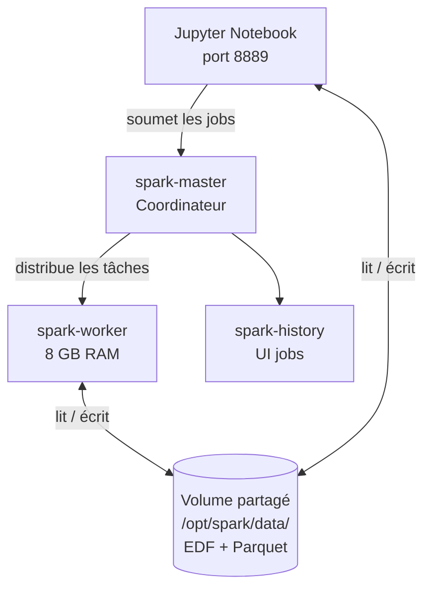
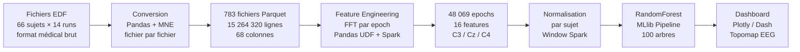
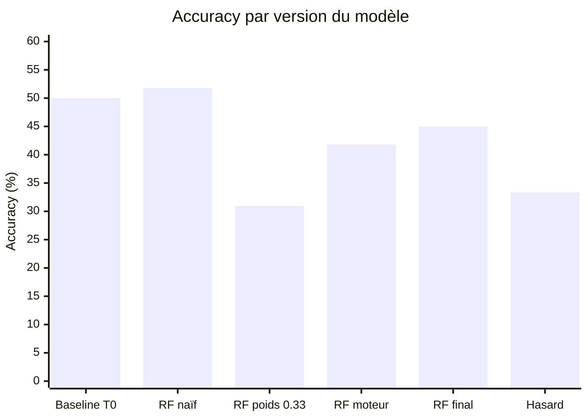

# Rapport Réflexif — PoC Analyse EEG avec Apache Spark
**UE28 Big Data — HELMo 2025-2026**  
**Étudiant :** Emir Makhtsaev  
**Date de remise :** 19 avril 2026  
**Projet :** Analyse d'imagerie motrice EEG en environnement distribué

---

## 1. Pourquoi ce dataset — et le livre qui a tout changé

Vous nous avez demandé de choisir un sujet qui nous ressemble vraiment — quelque chose qu'on aime, qui nous parle, qui pourrait nous apprendre quelque chose sur nous-mêmes. Et c'est là que ça a pris un tournant inattendu pour moi.

Au départ, j'avais pensé à faire quelque chose sur le corps humain, sur le physique. Et puis j'ai commencé un autre sujet — les entreprises belges qui ne sont toujours pas passées à Peppol. Techniquement c'était faisable, le dataset existait, j'avais un plan. Mais à mi-chemin je me suis arrêté. J'ai réalisé que je faisais ça parce que j'avais *décidé* de le faire — pas parce que ça m'intéressait vraiment. Je me forçais. Et ça sert à quoi de passer des semaines sur un sujet si ça t'apprend rien sur toi-même ?

J'aime la psychologie. Comprendre comment les émotions fonctionnent, pourquoi on pense à certaines choses, pourquoi on réagit de certaines façons sans l'avoir décidé. Ce qui m'attire là-dedans, c'est pas la théorie pure — c'est que ça m'aide à me comprendre moi. Pourquoi je fais certaines choses. Pourquoi certains patterns reviennent. Comprendre ça, c'est comprendre qui on est.

Mais la question qui me fascine le plus, c'est celle-ci : est-ce que nos pensées peuvent nous changer physiquement et mentalement ? Pas métaphoriquement — vraiment. Est-ce qu'une pensée répétée, une croyance, une façon de se parler peut modifier quelque chose de concret dans le cerveau, dans le corps ? Parce que si c'est le cas, ça veut dire qu'on a bien plus de contrôle sur ce qu'on devient qu'on le croit. Ce serait incroyable de pouvoir le mesurer.

J'avais ce livre depuis un moment — *La Biologie des Croyances* de Bruce Lipton, biologiste cellulaire, anciennement prof à Stanford. Je l'avais commencé, trouvé incroyable, et mis de côté parce que les projets s'étaient accumulés. Quand vous avez introduit ce projet et dit de choisir quelque chose qui nous touche, ce livre m'est revenu immédiatement. Lipton y explique que nos cellules ne sont pas juste commandées par nos gènes — elles répondent à l'environnement, aux signaux électriques, aux pensées. Dès la page 102 :


J'ai fait le lien immédiatement avec l'EEG. Si la pensée peut contrôler des comportements biologiques — et que le cerveau produit des ondes électriques mesurables — alors on devrait pouvoir voir l'effet d'une pensée dans des données. Pas juste théoriquement. Vraiment. Et là je me suis chauffé. C'était plus un projet scolaire, c'était une façon de prouver quelque chose qui me tenait à cœur depuis longtemps.

Il va encore plus loin, page 139, en expliquant que les fréquences électromagnétiques sont **cent fois plus efficaces** que les signaux chimiques (hormones, neurotransmetteurs) pour communiquer avec les cellules. Ce qui veut dire que ce que le cerveau envoie électriquement a plus d'impact que ce qu'il envoie chimiquement. J'ai trouvé ça incroyable — et ça donnait une vraie base scientifique à ce que je voulais tester.

Et page 169, il dit quelque chose que j'ai relu plusieurs fois :


C'est exactement l'imagerie motrice. Quand quelqu'un imagine bouger sa main sans bouger, le système nerveux envoie quand même les signaux. Le corps reçoit l'ordre, même si aucun mouvement ne suit. Et c'est mesurable — c'est ce que ce dataset montre.

Dès le prologue, page 18, il pose la thèse centrale du livre :


J'ai trouvé le dataset **EEG Motor Movement/Imagery** de PhysioNet : des gens qui imaginent bouger leur main gauche ou droite, et dont les ondes cérébrales changent réellement, comme s'ils le faisaient vraiment. Le lien avec Lipton était parfait. Ce projet pour moi c'est pas juste "valider un pipeline Big Data" — c'est une première tentative de mesurer concrètement quelque chose que je voulais comprendre depuis longtemps : que ce qu'on pense a un effet physique réel, mesurable, sur ce qu'on est. Et le fait que j'ai pu le voir dans les données, c'est ce qui m'a le plus marqué dans tout ce semestre.

*(Note : si vous avez des suggestions de lectures, de datasets ou de sujets liés au cerveau, aux émotions ou à la psychologie — je suis vraiment preneur. C'est mon hobby, pas juste un cours. J'adorerais avoir des pistes pour aller plus loin.)*

> **Note sur le livre :** Le PDF de *La Biologie des Croyances* se trouve dans le dossier `data/` du projet. Je sais que la data du projet n'est normalement pas censée être dans le zip — mais là c'est un livre que je vous donne, on sait jamais, ça peut vous intéresser.

---

## 2. Architecture et environnement technique

Pour faire tourner tout ça, j'ai utilisé un cluster Spark distribué orchestré par Docker :

| Composant | Rôle |
|---|---|
| `spark-master` | Coordinateur du cluster + Jupyter (port 8889) |
| `spark-worker` | Nœud d'exécution (8 GB RAM alloués) |
| `spark-history` | Interface historique des jobs |
| Volume `/opt/spark/data/` | Stockage partagé EDF + Parquet |

**Stack :** Python 3, PySpark 3.5.5, MNE, NumPy, Pandas, Plotly/Dash, MLlib  
**Format de données :** EDF (format médical brut) → Parquet (traitement distribué)



---

## 3. Ce que j'ai fait — pipeline complet



### Partie A — Conversion EDF → Parquet

Les données brutes sont en format `.edf`, un format médical que Spark ne sait pas lire directement. J'ai utilisé la librairie MNE pour les lire et les convertir en Parquet — un format colonnaire que Spark gère beaucoup mieux.

Chaque ligne du Parquet correspond à **un échantillon temporel** (1/160 seconde), avec les colonnes `subject_id`, `run_id`, `time`, `task_label`, et les 64 canaux EEG. J'ai aussi associé chaque sample à son label (T0/T1/T2) en lisant les annotations temporelles du fichier.

Cette conversion se fait avec Pandas/MNE sur un fichier à la fois — pas avec Spark — parce qu'un fichier EDF c'est 20 000 lignes maximum, et distribuer ça serait comme sortir le camion de déménagement pour porter une boîte de céréales. Mais une fois tous les fichiers convertis en Parquet, Spark peut tout lire en parallèle et vraiment apporter de la valeur.

**Résultat :** 783 fichiers Parquet, 0 erreur, 66 sujets × 12 runs moteurs.

**Structure d'une ligne du Parquet brut :**

| Colonne | Type | Exemple | Description |
|---|---|---|---|
| `subject_id` | string | `S001` | La personne enregistrée — 66 sujets au total (S001 → S066) |
| `run_id` | string | `R03` | La session d'enregistrement. Chaque sujet a fait 14 sessions de ~2 min. R01/R02 = repos de référence (yeux ouverts/fermés, pas de tâche). R03 → R14 = les 12 sessions motrices qu'on utilise. |
| `time` | float | `0.00625` | L'instant du sample en secondes. À 160 Hz, un sample toutes les 1/160s ≈ 6ms. |
| `task_label` | string | `T0` | Ce que le sujet faisait à cet instant : **T0** = repos, **T1** = imaginer bouger la main gauche, **T2** = imaginer bouger la main droite |
| `C3` | float | `0.000421` | Signal électrique en Volts capté par l'électrode C3 — au-dessus du cortex moteur gauche (contrôle main droite) |
| `Cz` | float | `-0.000138` | Signal électrique capté par l'électrode Cz — au centre du crâne, au-dessus du cortex moteur |
| `C4` | float | `0.000309` | Signal électrique capté par l'électrode C4 — au-dessus du cortex moteur droit (contrôle main gauche) |
| *(+ 61 autres canaux)* | float | — | Électrodes sur les zones frontales, temporales, occipitales — aucun lien avec l'imagerie motrice, non utilisées |

### Partie B — Exploration avec Spark

Première vraie leçon avec Spark : la **lazy evaluation**. Quand j'écris `df = spark.read.parquet(...)`, Spark ne fait rien. Il construit juste un plan. Le calcul ne se déclenche que quand j'appelle une action comme `.count()` ou `.show()`. Au début j'attendais des résultats qui n'arrivaient pas — c'est parce que je n'avais pas encore compris ça. J'ai cru que mon code était planté alors que Spark attendait juste que je lui dise d'exécuter.

**Ce que j'ai découvert :**
- 15 264 320 lignes, 68 colonnes
- T0 (repos) = 50% des données, T1 (main gauche) = 25%, T2 (main droite) = 25%
- Ce déséquilibre allait me poser des problèmes plus tard

### Partie C — Feature Engineering (FFT spectrale)

C'est la partie la plus complexe. Le signal EEG brut est trop bruité et trop long pour être donné directement au modèle. J'ai donc extrait des **caractéristiques fréquentielles** — la puissance dans quatre bandes de fréquence qui ont chacune une signification neurologique :

| Bande | Fréquences | Ce que ça veut dire |
|---|---|---|
| Theta | 4–8 Hz | Préparation motrice, mémoire de travail |
| Alpha | 8–13 Hz | Se désynchronise quand on imagine un mouvement (ERD) |
| Beta | 13–30 Hz | Rebond après le mouvement (ERS) |
| Gamma | 30–80 Hz | Traitement cognitif fin |

Le processus en trois étapes :
1. **Découpage en epochs** — fenêtres de 2 secondes (320 samples) via `floor(time / 2)`
2. **Collecte ordonnée par epoch** — on collecte des structs `(time, valeur)`, triés avec `array_sort()`, puis `transform()` extrait les valeurs dans l'ordre temporel garanti. `collect_list()` seul ne garantit pas l'ordre après un shuffle Spark — si les 320 samples arrivent mélangés, la FFT calcule des fréquences dans un signal aléatoire, pas dans le signal réel.
3. **FFT via Pandas UDF** — une fonction Python applique la Transformée de Fourier sur chaque epoch et retourne la puissance dans la bande voulue

Ce qui m'a le plus intéressé ici, c'est que la bande Alpha **diminue** quand on imagine un mouvement. Le cerveau au repos oscille en Alpha. Quand il s'active pour simuler un geste, cette activité disparaît — c'est ce qu'on appelle l'ERD (Event-Related Desynchronization). Ça illustre exactement ce que Lipton explique page 139 : le signal électrique prime. La pensée d'un mouvement désactive l'état de repos électrique du cerveau, avant même que le mouvement existe.

**Les 16 features après engineering :**

| Feature | Calcul | Ce qu'elle mesure |
|---|---|---|
| `C3_theta` | Puissance FFT 4–8 Hz sur C3 | Préparation motrice côté gauche |
| `C3_alpha` | Puissance FFT 8–13 Hz sur C3 | Activité de repos côté gauche (↓ pendant imagerie) |
| `C3_beta` | Puissance FFT 13–30 Hz sur C3 | Rebond moteur post-mouvement côté gauche |
| `C3_gamma` | Puissance FFT 30–80 Hz sur C3 | Traitement cognitif fin côté gauche |
| `Cz_theta` | Puissance FFT 4–8 Hz sur Cz | Préparation motrice centrale |
| `Cz_alpha` | Puissance FFT 8–13 Hz sur Cz | Activité de repos centrale |
| `Cz_beta` | Puissance FFT 13–30 Hz sur Cz | Rebond moteur central |
| `Cz_gamma` | Puissance FFT 30–80 Hz sur Cz | Traitement cognitif fin central |
| `C4_theta` | Puissance FFT 4–8 Hz sur C4 | Préparation motrice côté droit |
| `C4_alpha` | Puissance FFT 8–13 Hz sur C4 | Activité de repos côté droit (↓ pendant imagerie) |
| `C4_beta` | Puissance FFT 13–30 Hz sur C4 | Rebond moteur post-mouvement côté droit |
| `C4_gamma` | Puissance FFT 30–80 Hz sur C4 | Traitement cognitif fin côté droit |
| `diff_theta` | `C3_theta - C4_theta` | Asymétrie hémisphérique — préparation motrice |
| `diff_alpha` | `C3_alpha - C4_alpha` | Asymétrie alpha : + si T2 (main droite), - si T1 (main gauche) |
| `diff_beta` | `C3_beta - C4_beta` | Asymétrie du rebond post-mouvement |
| `diff_gamma` | `C3_gamma - C4_gamma` | Asymétrie du traitement cognitif |

**Résultat :** 48 069 epochs, 16 features chacune (3 canaux × 4 bandes + 4 différences C3-C4).

### Partie D — Classification MLlib

Le pipeline MLlib enchaîne trois étapes :
- `StringIndexer` : convertit T0/T1/T2 en entiers
- `VectorAssembler` : fusionne les colonnes en un vecteur dense
- `RandomForestClassifier` : hyperparamètres choisis par cross-validation

J'ai ajouté une **recherche d'hyperparamètres avec `CrossValidator` + `ParamGridBuilder`** : plutôt que de fixer `numTrees=100` et `maxDepth=10` arbitrairement, on teste les 4 combinaisons (numTrees ∈ {50, 100} × maxDepth ∈ {5, 10}) sur 3 folds de validation croisée, soit 12 entraînements. Le meilleur modèle est retenu. C'est la même logique qu'un `GridSearchCV` en sklearn, mais distribué sur le cluster.

J'ai eu trois essais avant d'arriver à quelque chose de correct. Les détails sont dans la section 4.

### Partie E — Dashboard interactif

J'ai construit un dashboard Dash avec plusieurs visualisations :
- Signal EEG brut coloré par tâche
- Matrice de confusion avec pourcentages
- Recall / Précision / F1 par classe
- Graphique de latéralisation C3-C4 (le plus intéressant visuellement)
- Puissance spectrale par bande avec sélecteur interactif
- Feature importance du RandomForest
- **Topomap EEG interactive** — une heatmap interpolée sur la forme d'une tête, comme dans les publications scientifiques, avec dropdown pour choisir la tâche et la bande

La topomap permet de voir en direct comment l'activité cérébrale se déplace entre T0, T1 et T2 — et de constater que C3 et C4 s'inversent selon la main imaginée. C'est le truc le plus proche de ce que Lipton décrit quand il parle de "signaux invisibles qui commandent le comportement" — on les voit, là, sur une heatmap de cerveau.

---

## 4. Difficultés rencontrées — les vraies, avec les détails

### 4.1 Les noms de colonnes avec des points — erreur dès le départ

Au tout début, quand j'ai lu les fichiers Parquet dans Spark et tenté de faire la première opération sur les colonnes, j'ai eu ça :

```
AnalysisException: Resolved attribute(s) C3.. missing from [...]
```

J'ai passé genre 20 minutes à relire mon code en me demandant où j'avais fait une faute. Rien de visible. Puis j'ai inspecté les noms de colonnes avec `.columns` et j'ai vu que MNE nommait les canaux `C3..`, `Cz..`, `C4..` — avec des points à la fin, qui viennent du format EDF.

Le problème : dans Spark SQL, le point est un séparateur de namespace — `df.C3.col` veut dire "l'attribut `col` de la structure `C3`". Spark essayait d'interpréter `C3..` comme une référence à une struct inexistante. La solution c'était de renommer toutes les colonnes au début du pipeline, avant de faire quoi que ce soit d'autre.

**Ce que j'ai appris :** Toujours afficher `.columns` avant de commencer à manipuler un DataFrame qu'on vient de lire. Les caractères spéciaux dans les noms de colonnes sont des pièges invisibles.

### 4.2 Le déséquilibre de classes — trois essais pour trouver le bon réglage

C'est l'erreur qui m'a le plus appris, parce que j'ai dû me planter deux fois avant de comprendre vraiment ce qui se passait.

**Essai 1 — sans pondération, 192 features :** 51,78% d'accuracy. J'étais content au départ. Puis j'ai regardé la matrice de confusion. Le modèle prédisait T0 pour quasi tout. Logique : 50% des données sont T0, donc prédire T0 en permanence donne mécaniquement 50% d'accuracy sans rien apprendre. J'avais pas fait le lien entre le déséquilibre et l'accuracy.

**Essai 2 — pondération T0 = 0.33 :** J'ai essayé de corriger trop fort. Résultat : 30,93% — pire que le hasard. Le modèle avait tellement peur de prédire T0 qu'il le prédisait même quand c'était T0. L'inverse exact du problème précédent. J'ai compris à ce moment que le réglage du poids c'est pas intuitif — il faut y aller doucement.

**Essai 3 — T0 = 0.5, uniquement C3/Cz/C4 :** Deux changements en même temps. D'abord, poids à 0.5 au lieu de 0.33 — juste assez pour dire au modèle que T0 est moins important, sans l'éliminer. Ensuite, j'ai réalisé que mes 192 features (64 canaux × 3 bandes) ajoutaient beaucoup de bruit. Le casque EEG a 64 électrodes réparties sur toute la tête — la zone frontale c'est le front (plutôt lié à la concentration et aux émotions), la zone occipitale c'est l'arrière du crâne (liée à la vision), la zone temporale c'est les côtés (liée au langage et à la mémoire). Aucune de ces zones n'a de lien direct avec le fait d'imaginer bouger une main. Par contre, C3, Cz et C4 sont trois électrodes placées au sommet du crâne, pile au-dessus du cortex moteur — la partie du cerveau qui commande les mouvements. C3 est légèrement à gauche, C4 légèrement à droite, Cz au centre. Ce sont les seules zones qui réagissent vraiment quand on imagine un geste. Résultat : 44,97%.

**Leçon :** L'accuracy seule ne dit strictement rien sur un dataset déséquilibré. Toujours regarder la matrice de confusion. Et le feature selection, c'est autant du sens du domaine que des maths.

### 4.3 La data leakage — j'avais pas compris le problème du split

Pendant un moment j'avais un split aléatoire sur les epochs. Mon modèle affichait une bien meilleure accuracy. J'étais convaincu d'avoir trouvé la bonne approche.

Puis quelqu'un m'a demandé : "Si le sujet 5 a des epochs dans le train ET dans le test, qu'est-ce qui se passe ?" J'ai réfléchi et j'ai compris le problème. Le signal EEG de chaque personne a une "empreinte" — des patterns liés à sa morphologie crânienne, son niveau de stress, son âge, etc. Quand j'avais des epochs du même sujet dans train et test, le modèle apprenait à reconnaître le style EEG du sujet, pas la tâche. Il "mémorisait" chaque personne. C'est ce qu'on appelle le data leakage.

La solution : split strict par sujet. S001–S052 entraînement, S053–S066 test. Ces sujets-là, le modèle ne les a jamais vus. L'accuracy a baissé — et c'est normal. C'est l'accuracy réelle, pas celle gonflée par la mémorisation.

**Leçon :** En ML sur des données médicales ou biométriques, le split par identité (sujet, patient, utilisateur) est presque toujours obligatoire. Un split aléatoire sur des données temporelles ou personnelles donne des résultats faussement bons.

### 4.4 La normalisation oubliée — j'ai découvert le problème par hasard

Pendant une itération, j'avais pas encore ajouté la normalisation par sujet. Le modèle fonctionnait, les résultats semblaient raisonnables. J'avais pas réalisé le problème.

Puis j'ai eu une discussion sur ce que le modèle "voyait" vraiment. Si chaque personne a des amplitudes EEG différentes — parce que l'épaisseur du crâne conduit différemment le signal — alors les features brutes mélangent deux informations : la tâche ET l'identité du sujet. Le modèle pouvait apprendre à distinguer les sujets plutôt que les tâches, même avec un bon split.

La solution : normaliser par sujet avec une Window function Spark — pour chaque feature, soustraire la moyenne du sujet et diviser par son écart-type. Ce qui reste, c'est uniquement la variation relative à ce sujet, pas son amplitude absolue.

```python
w = Window.partitionBy('subject_id')
# normalisation : (valeur - moyenne_sujet) / (écart_type_sujet + epsilon)
```

**Leçon :** La normalisation en ML c'est pas juste "mettre les features entre 0 et 1". C'est réfléchir à quelle information on veut garder et quelle information on veut supprimer. Ici, on voulait supprimer "l'effet sujet" pour garder "l'effet tâche".

### 4.5 "Spark natif" — j'avais pas compris ce que ça voulait dire

Au début du projet, je pensais que "Spark natif" voulait dire "sans NumPy ni Pandas". Je m'étais mis comme contrainte d'éviter ces librairies à tout prix. Résultat : je cherchais comment faire de la FFT avec les seules fonctions SQL de Spark, ce qui n'existe pas vraiment.

J'ai finalement compris que "Spark natif" ça veut dire utiliser l'API DataFrame/MLlib de Spark — pas traiter 15M de lignes avec Pandas. NumPy dans une UDF Spark, c'est parfaitement standard et c'est même la bonne façon de faire du feature engineering custom. Spark distribue le travail, NumPy fait le calcul dans chaque partition.

**Leçon :** Bien comprendre ce qu'une contrainte signifie avant de commencer. J'aurais pu poser la question dès le départ.

### 4.6 Le notebook perdu entre deux sessions Docker

À mi-projet, j'ai relancé mes conteneurs Docker et découvert que mes modifications dans Jupyter avaient disparu. Le serveur Jupyter dans le conteneur `spark-master` avait été recréé depuis l'image de base — et mes changements non committés n'existaient plus.

C'était chaud. J'ai dû reconstruire plusieurs cellules de mémoire. Depuis, je commite ou sauvegarde sur le volume monté avant d'arrêter les conteneurs.

**Leçon :** Dans Docker, rien ne persiste entre les sessions sans être écrit sur un volume monté. Les processus, les paquets pip installés à la volée, les fichiers hors volume — tout disparaît.

---

## 5. Ce que j'ai compris — Spark en profondeur

### 5.1 Lazy evaluation — je le savais, mais j'avais oublié de l'appliquer

Chaque transformation Spark (`.filter()`, `.groupBy()`, `.withColumn()`) ne fait rien immédiatement. Spark construit un plan d'exécution logique — le DAG. Ce n'est qu'au moment d'une action (`.count()`, `.show()`, `.write()`) que Spark optimise ce plan et l'exécute en distribué.

Ce principe, je le connaissais théoriquement. On l'avait vu en cours. Mais dans le feu de l'action, j'avais complètement oublié. J'attendais des résultats sur des cellules qui n'avaient que des transformations — rien ne se passait parce que j'avais pas encore déclenché d'action. C'est un bon exemple de la différence entre savoir un truc et le retrouver automatiquement quand on code. Une fois que j'ai refait le lien, j'ai commencé à structurer mes cellules différemment — une cellule de transformations, une cellule d'action séparée pour vérifier.

### 5.2 Parquet vs CSV — la lecture colonnaire

Parquet stocke les données colonne par colonne. CSV stocke ligne par ligne. Avec 68 colonnes et 15M de lignes, quand Spark a besoin uniquement de `C3`, `C4`, `subject_id`, `task_label` — il lit ces 4 colonnes uniquement avec Parquet. Avec CSV, il lirait les 68 colonnes pour extraire 4. Sur 15M de lignes, c'est pas la même chose.

### 5.3 Arrow et Pandas UDF — 576 000 appels → des batchs

La version naïve d'une UDF Spark sérialise chaque ligne individuellement entre la JVM (Java Virtual Machine) et Python. Avec 48 069 epochs × 4 bandes × 3 canaux = 576 828 appels, chacun avec sa propre sérialisation pickle. C'est énorme.

Les Pandas UDF (`@pandas_udf`) utilisent Apache Arrow — un format colonnaire en mémoire partagée entre la JVM et Python. Au lieu de 576k appels individuels, Spark envoie des batchs entiers via Arrow, sans copie de données. C'est significativement plus rapide, et c'est la bonne façon de faire du feature engineering Python à grande échelle.

```python
@pandas_udf(DoubleType())
def band_power_udf(signals: pd.Series) -> pd.Series:
    return signals.apply(compute)  # appelé une fois par batch, pas par ligne
```

### 5.4 shuffle.partitions = 32 — pas 200

Par défaut, Spark crée 200 partitions après un shuffle (groupBy, join). Avec seulement 66 sujets, 134 partitions seraient vides — des tâches qui se lancent, trouvent rien, et s'arrêtent. Du gaspillage pur.

J'ai mis `spark.sql.shuffle.partitions = 32` — un peu moins que 66, ce qui garantit une charge assez équilibrée sans créer trop de petites partitions.

### 5.5 select() au lieu d'une boucle withColumn()

Pour la normalisation, j'avais d'abord une boucle qui ajoutait une colonne à la fois :

```python
for fc in feature_cols:
    df = df.withColumn(fc, normalize(fc))  # 16 fois
```

Chaque appel à `withColumn()` crée un nouveau plan logique. Avec 16 colonnes, Spark analyse le plan 16 fois. En remplaçant par un seul `select()` avec toutes les expressions, Spark analyse le plan une fois.

```python
df_norm = df_features.select(norm_exprs)  # une seule analyse de plan
```

### 5.6 cache() — éviter de recalculer 16 expressions Window deux fois

Après la normalisation, le DataFrame `df_norm_w` était utilisé deux fois : une fois pour compter les classes (déclencher l'action `.count()`), une fois pour l'entraînement. Sans cache, Spark recalculait toute la chaîne de transformations (16 Window expressions) deux fois.

`df_norm_w.cache()` garde le résultat en mémoire après la première exécution. La deuxième fois, Spark va chercher directement en cache. Et `unpersist()` après l'entraînement libère cette mémoire pour que les workers puissent l'utiliser pour autre chose.

### 5.7 Window.partitionBy — normaliser par sujet sans mélanger les sujets

La Window function est l'équivalent Spark d'un GROUP BY pour les fonctions analytiques. `Window.partitionBy('subject_id')` garantit que la moyenne et l'écart-type calculés pour normaliser les features d'un sujet utilisent **uniquement les données de ce sujet**, jamais celles des autres.

```python
w = Window.partitionBy('subject_id')
# F.mean(fc).over(w) = moyenne de fc pour ce sujet uniquement
```

Sans ça, la normalisation serait globale — et les sujets qui ont naturellement des amplitudes EEG plus fortes resteraient dominants.

### 5.8 Pipeline MLlib — éviter le data leakage dans les transformations

Sans Pipeline, on fait souvent :
1. Entraîner le StandardScaler sur tout le dataset
2. Transformer train et test
3. Entraîner le modèle sur train

Le problème : le scaler a vu les statistiques du jeu de test lors de l'étape 1. C'est du data leakage — le modèle a une information qu'il ne devrait pas avoir.

Avec `Pipeline([StringIndexer, VectorAssembler, RandomForest])`, Spark appelle `.fit()` uniquement sur le train, puis `.transform()` sur le test avec les paramètres appris sur le train uniquement. La protection est garantie par la structure, pas par la discipline du développeur.

### 5.9 df.explain() — voir ce que Catalyst a vraiment décidé

Spark ne fait pas qu'exécuter le code tel qu'on l'écrit. Il passe d'abord par le Catalyst Optimizer — un moteur interne qui analyse le plan logique, applique des règles d'optimisation (pousser les filtres tôt, supprimer les colonnes inutiles, regrouper les opérations), puis génère un plan physique optimisé.

`df.explain()` permet de voir ce plan réel, celui que Spark va vraiment exécuter. C'est utile pour vérifier que les optimisations qu'on pense avoir faites ont bien été prises en compte. Par exemple, après avoir remplacé la boucle de `withColumn()` par un seul `select()` pour la normalisation, le `explain()` montre que Spark a bien regroupé les 16 Window expressions en un seul passage — au lieu de 16 stages séparés.

C'est le genre de truc qu'on peut pas voir juste en lisant le code. Le code *dit* ce qu'on veut faire, mais `explain()` montre ce que Spark *va vraiment faire*.

### 5.10 toPandas() — uniquement en fin de pipeline, sur des petits sous-ensembles

Appeler `.toPandas()` ramène toutes les données sur le driver (l'ordinateur qui exécute le notebook). Si je l'avais appelé sur les 15M de lignes brutes, j'aurais planté le driver avec un OutOfMemoryError.

La règle que j'ai appliquée : `.toPandas()` uniquement après toutes les agrégations, sur des résultats petits (accuracy, matrix de confusion, feature importance — quelques dizaines de lignes). Les transformations sur les grandes données restent distribuées dans Spark.

---

## 6. Résultats

| Version | Features | Pondération T0 | Accuracy | Remarque |
|---|---|---|---|---|
| Baseline (prédire T0 toujours) | — | — | ~50% | Ne prédit que T0 |
| RF naïf | 192 (64 canaux) | Aucune | 51,78% | Même problème |
| RF pondéré agressif | 192 (64 canaux) | 0.33 | 30,93% | Sous le hasard |
| RF moteur pondéré | 9 (C3/Cz/C4 × 3 bandes) | 0.5 | 41,82% | Première version correcte |
| **RF final (+ diff + norm + split)** | **16 (4 bandes + 4 diff C3-C4)** | **0.5** | **44,97%** | **Version finale** |
| Baseline aléatoire | — | — | 33,33% | Référence |



**Performance par classe (sujets S053–S066, jamais vus à l'entraînement) :**

| Métrique | Valeur | Pourquoi c'est pertinent |
|---|---|---|
| Accuracy | 44,97% | Référence globale — mais trompeuse seule |
| F1 weighted | 43,70% | Moyenne précision/rappel pondérée par classe — plus fiable sur un dataset déséquilibré |
| Precision weighted | 43,02% | Quand le modèle dit T1, est-ce vraiment T1 ? |
| Recall weighted | 44,97% | Parmi tous les vrais T1, combien détectés ? |

| Classe | Rappel | Interprétation |
|---|---|---|
| T0 — Repos | 63,47% | Le mieux reconnu — signal de fond distinct |
| T1 — Main gauche | 31,51% | Souvent confondu avec T0 |
| T2 — Main droite | 19,18% | Le plus difficile — très proche de T1 |

44,97% contre 33% au hasard — le modèle apprend quelque chose. Mais la confusion entre T1 et T2 montre les limites : avec seulement 3 canaux et de la puissance spectrale brute, les patterns des deux mains sont trop proches pour être bien séparés. Les recherches publiées atteignent 70–85% avec des méthodes plus avancées — des algorithmes comme le CSP (qui isole les composantes cérébrales les plus discriminantes) ou le LSTM (un réseau de neurones qui analyse les séquences temporelles). Je connaissais pas ces techniques avant ce projet, et j'aurais vraiment aimé les explorer — mais j'ai pas bien géré mon temps et j'ai pas pu aller jusque là. Honnêtement, je sais même pas si pour un PoC c'est attendu d'aller aussi loin ou si c'est trop — c'est une question que je me pose encore.

---

## 7. Améliorations apportées

**Différence C3-C4** — Ajouter `C3 - C4` pour chaque bande capture directement la latéralisation hémisphérique. Le cerveau est contralatéral : C3 (hémisphère gauche) contrôle la main droite, C4 (hémisphère droit) contrôle la main gauche. Pour T2 (main droite), C3 domine → diff positive. Pour T1 (main gauche), C4 domine → diff négative. Plus discriminant que les deux canaux séparément.

**Normalisation par sujet** — Chaque personne a des amplitudes EEG différentes à cause de l'épaisseur variable du crâne (conductivité différente). Sans normalisation, le modèle apprend qui est le sujet, pas quelle tâche il fait. J'ai normalisé chaque feature par sujet avec une Window function Spark.

**Split par sujet dynamique** — Un split aléatoire mélange les epochs du même sujet entre train et test. Le modèle "reconnaît" alors le style EEG du sujet plutôt que la tâche. J'ai séparé strictement par sujet (80% train / 20% test) en récupérant la liste réelle des sujets présents dans les données via `.distinct().collect()` — pas une plage hardcodée `range(1, 53)`. Si des fichiers EDF ont été perdus pendant la conversion, le split reste valide automatiquement.

**Bande Theta (4–8 Hz)** — Ajoutée pour capturer la préparation motrice. Passe de 12 à 16 features.

**Pandas UDF avec Arrow** — Remplacement des UDF classiques par des Pandas UDF pour éviter 576k sérialisations individuelles entre la JVM et Python.

**Ordre temporel dans collect_list** — `collect_list()` dans Spark ne garantit pas l'ordre des éléments après un shuffle. Si les 320 samples d'un epoch arrivent dans un ordre aléatoire dans la liste, la FFT calcule la puissance d'un signal mélangé — les résultats sont faux. La correction : collecter des structs `(time, valeur)`, trier avec `array_sort()`, puis extraire les valeurs avec `transform()`. C'est un piège classique de Spark sur les agrégations de séquences temporelles.

**Métriques d'évaluation complètes** — L'accuracy seule est insuffisante sur un dataset déséquilibré (50% T0). Ajout du F1 weighted, weightedPrecision et weightedRecall pour avoir une image réelle de ce que le modèle distingue.

**Cross-validation (CrossValidator + ParamGridBuilder)** — Plutôt que des hyperparamètres fixes, le modèle teste automatiquement 4 combinaisons (numTrees × maxDepth) sur 3 folds de validation croisée. 12 entraînements au total, meilleur modèle retenu. C'est une optimisation qui peut être coûteuse mais donne une évaluation plus fiable sur des données aussi variables que l'EEG.

**Ce qui n'est pas dans ce PoC — Spark Structured Streaming** — La question m'avait été posée : pourquoi pas du streaming ? En pratique le streaming EEG en temps réel (lire les ondes pendant qu'elles arrivent et prédire la tâche en direct) aurait été pertinent — c'est ce qui se fait dans les interfaces cerveaux-machine. Mais ça n'est pas l'objet de cette étape. Le streaming, c'est prévu pour l'étape 3 (Data Engineering). Ce PoC a pour but de valider que le pipeline de classification fonctionne sur des données historiques. On part de l'existant, on prouve que ça marche, et ensuite seulement on ajoute la dimension temps réel.

---

## 8. Conclusion et suite

Ce projet m'a permis de prouver avec des calculs quelque chose que je croyais déjà — mais que je n'avais jamais pu mesurer. Le lien entre la pensée et le corps, entre ce qu'on imagine et ce que le cerveau fait réellement, c'est pas une nouveauté pour moi. Je lisais déjà Lipton, je m'intéressais déjà à ça. Donc honnêtement, sur le fond du sujet, j'ai pas appris grand chose de nouveau. Ce que j'ai appris, c'est que c'est mesurable. Que la bande Alpha qui chute au moment de l'imagerie motrice, que C3 et C4 qui s'inversent selon la main imaginée — c'est visible dans des données réelles, avec des outils techniques. Ça transforme une conviction en quelque chose de démontrable.

C'est aussi la première fois que je mélange vraiment travail et passion. D'habitude c'est l'un ou l'autre — soit on fait ce qu'on nous demande, soit on fait ce qu'on aime dans son coin. Là, pour la première fois, les deux se rejoignent. Et c'est une sensation différente. On s'investit autrement, on cherche plus loin, on supporte mieux les erreurs parce qu'on a envie de comprendre, pas juste de finir. Si je pouvais faire tout ce que j'ai envie d'explorer — les émotions, l'identité, l'effet des pensées sur le cerveau — avec des vrais outils de data, ce serait incroyable. Je réalise avec ce projet que c'est peut-être possible.

Techniquement, j'ai construit un pipeline Big Data complet sur des données réelles : conversion de format médical, feature engineering distribué avec FFT et Pandas UDF, classification avec MLlib, dashboard interactif. Les erreurs que j'ai faites — déséquilibre de classes, data leakage, mauvaise pondération, normalisation oubliée — sont des erreurs classiques en production. Les avoir rencontrées, déboguées, et comprises vaut autant que le résultat final.

Pour la partie Data Engineering en mai, je veux fusionner ce dataset avec DEAP — un dataset qui enregistre l'EEG de personnes qui regardent des vidéos émotionnelles. Pas pour faire une démo technique. Ma vraie question, c'est de savoir si ce qu'on est — notre personnalité, nos réactions, le fait d'être trop gentil, trop dans notre tête, trop dans nos émotions — c'est quelque chose avec lequel on naît, ou quelque chose qui se construit et qu'on peut changer. Je pense que c'est construit. Et si les patterns EEG liés aux émotions évoluent selon les expériences vécues, ça pourrait en être une preuve mesurable.

Ce qui m'intéresse encore plus, c'est la question suivante : est-ce que nos pensées peuvent nous changer ? Pas dans le sens vague du développement personnel — mais vraiment, physiquement et mentalement. Est-ce qu'une pensée répétée, une croyance ancrée, une façon de se parler à soi-même peut modifier quelque chose de mesurable dans le cerveau ? C'est exactement ce que Lipton suggère avec ses recherches sur les cellules — que le signal mental prime sur le signal chimique. Si on pouvait observer ça dans des données EEG réelles, voir un pattern cérébral évoluer en fonction de ce qu'une personne pense d'elle-même, ce serait quelque chose d'incroyable. Je sais pas encore si c'est faisable avec les outils qu'on a — mais c'est ce genre de question qui me donne envie de continuer.

---

*Rapport réflexif — 19 avril 2026 — UE28 Big Data, HELMo Liège*
