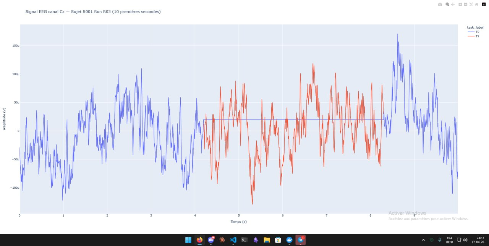
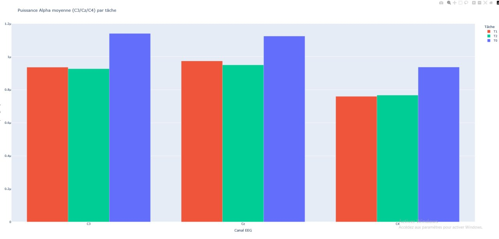
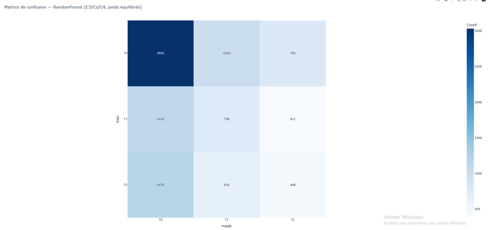

# NeuroSpark: Distributed EEG Motor Imagery Decoding

Distributed Big Data pipeline for decoding motor imagery from EEG signals. 66 subjects, 64 electrodes, PySpark + MLlib. From raw neural signals to classified imagined movements.

<p align="center">
  <video src="assets/neuro-spark-demo.mp4" width="800" controls></video>
</p>

---

## The Problem

Motor imagery — imagining moving your hand or foot — produces faint electrical patterns on the scalp. Detecting these patterns reliably is the foundation of Brain-Computer Interfaces: systems that let people control devices with thought alone.

The challenge? EEG signals are noisy, high-dimensional (64 channels × 160 Hz), and vary wildly across subjects. Traditional single-machine processing hits limits fast at this scale.

## Our Approach

We distribute the entire pipeline across a Spark cluster, from raw `.edf` ingestion to final classification.

```
Raw EDF ──▶ Preprocess ──▶ Feature Extraction ──▶ Classification ──▶ Dashboard
(66 subj)   (Filter+Epoch)   (FFT Band Power)     (RandomForest)    (Dash/Plotly)
```

---

## Dataset

| Property | Value |
|---|---|
| Source | PhysioNet EEG Motor Movement/Imagery |
| Subjects | 66 (S001–S066) |
| Electrodes | 64 (10-20 system) |
| Sampling Rate | 160 Hz |
| Total Rows | ~15 million (Parquet) |
| Classes | T0 (Rest), T1 (Left Fist), T2 (Right Fist/Feet) |

---

## Pipeline

### A. EDF → Parquet Conversion

Spark can't read `.edf` files natively. We use MNE-Python inside Spark UDFs to convert raw medical signals into Parquet — columnar, compressed, Spark-native.

- 783 Parquet files generated
- 66 subjects processed
- Each row = one temporal sample (1/160s)
- Columns: `subject_id`, `run_id`, `time`, 64 EEG channels, `task_label`

### B. Feature Engineering: Spectral FFT

Raw time-series signals are too noisy. We extract frequency-domain features using Fast Fourier Transform.

```
Signal ──▶ 2s windows ──▶ FFT ──▶ Band Power (Alpha/Beta/Gamma) ──▶ Feature Vector
```

| Band | Range | Relevance |
|---|---|---|
| Alpha (α) | 8–13 Hz | Sensorimotor rhythm — primary motor imagery signal |
| Beta (β) | 13–30 Hz | Active motor control, suppressed during imagery |
| Gamma (γ) | 30–80 Hz | Higher cognitive processing |

**Result:** 48,069 epochs × 192 features (64 channels × 3 bands).

### C. Machine Learning (Spark MLlib)

Three iterations, each documented with results:

| Version | Features | Class Weight | Accuracy | Key Insight |
|---|---|---|---|---|
| v1 | 192 (all channels) | None | 51.78% | Predicted T0 for everything — class imbalance |
| v2 | 192 | 0.33 (T0) | 30.93% | Ignored T0 entirely — worse than chance |
| **v3** | **9 (C3/Cz/C4)** | **0.5 (T0)** | **41.82%** | **Beat random (33%) by focusing on motor cortex** |

**Key discovery:** 61 of 64 channels were noise. Only C3, Cz, C4 (sensorimotor cortex electrodes) carry discriminative signal for motor imagery. Reducing features improved performance.

---

## Visualizations

### Raw EEG Signal — Channel Cz



Raw neural signal from the Cz electrode (vertex of the scalp). Blue = T0 (rest), Red = T2 (imagery). Note the difference in amplitude and oscillation patterns between rest and motor imagery states.

### Alpha Power by Task and Channel



T0 (rest) consistently shows higher alpha power across all motor cortex channels — the signature of Event-Related Desynchronization (ERD). During motor imagery, alpha power drops because the sensorimotor cortex becomes active.

### Confusion Matrix — RandomForest



The model excels at detecting rest (T0: 3032 correct) but struggles to distinguish left vs right hand imagery (T1/T2). This is expected — left/right motor imagery produces similar patterns on midline electrodes.

---

## Architecture

```
┌─────────────────────────────────────────────────────┐
│                  Docker Cluster                      │
│                                                      │
│  ┌──────────────┐    ┌──────────────┐               │
│  │  spark-master │    │ spark-worker │               │
│  │  + Jupyter    │───▶│  (8GB RAM)   │               │
│  │  :8889        │    │              │               │
│  └──────┬───────┘    └──────┬───────┘               │
│         │                   │                        │
│         ▼                   ▼                        │
│  ┌─────────────────────────────────┐                │
│  │   /opt/spark/data/ (shared)     │                │
│  │   ├── raw/    (EDF files)       │                │
│  │   └── processed/ (Parquet)      │                │
│  └─────────────────────────────────┘                │
│                                                      │
│  ┌──────────────┐    ┌──────────────┐               │
│  │spark-history │    │  Dashboard   │               │
│  │ :18080       │    │  :8050       │               │
│  └──────────────┘    └──────────────┘               │
└─────────────────────────────────────────────────────┘
```

---

## Dashboard

Interactive neuro-imaging dashboard built with Dash/Plotly.

| Panel | What It Shows |
|---|---|
| **Brain Topography** | Spatial activity map across 64 electrodes |
| **Band Power Analysis** | Frequency decomposition per brain region |
| **Confusion Matrix** | Classification accuracy per class |
| **Per-Subject Performance** | Accuracy distribution across subjects |
| **Feature Importance** | Which channels/bands drive classification |

---

## Per-Class Performance

| Class | Recall | Precision | Interpretation |
|---|---|---|---|
| T0 (Rest) | 54.2% | 55.7% | Distinct background signal — well recognized |
| T1 (Left Hand) | 37.9% | 27.9% | Often confused with T0 |
| T2 (Right Hand) | 19.9% | 28.4% | Hardest — similar patterns to T1 |

---

## Project Structure

```
neuro-spark/
├── Analyse Cerveau/
│   ├── warehouse/
│   │   └── etape1_poc/
│   │       └── poc_eeg.ipynb        # Main pipeline notebook
│   ├── scripts/                      # Utility scripts
│   ├── dashboard.py                  # Interactive monitoring dashboard
│   ├── rapport_reflexif_poc_eeg.md   # Reflexive report
│   ├── Dockerfile                    # Spark environment
│   ├── docker-compose.yml            # Cluster orchestration
│   └── entrypoint.sh                 # Container entrypoint
├── assets/                           # Screenshots, visuals & demo video
│   ├── signal_eeg.png
│   ├── confusion_matrix.png
│   ├── alpha_power.png
│   └── neuro-spark-demo.mp4          # 30s Remotion demo
├── .gitignore
├── LICENSE
└── README.md
```

---

## Quick Start

```bash
git clone https://github.com/ForgedEmir/neuro-spark.git
cd neuro-spark

# Launch Spark cluster
cd "Analyse Cerveau"
docker-compose up -d

# Open Jupyter (port 8889)
# Run poc_eeg.ipynb

# Launch dashboard
python dashboard.py  # → http://localhost:8050
```

---

## Key Concepts

**Lazy Evaluation** — Spark builds a DAG (execution plan) and only computes when an Action (.count(), .show()) is called. Understanding this is critical for debugging Spark jobs.

**Parquet > CSV** — Columnar format. Spark only reads needed columns, not entire rows. 10-100x faster for analytical queries.

**ERD (Event-Related Desynchronization)** — Alpha power decreases in the contralateral motor cortex during motor imagery. Imagine moving your right hand → alpha drops at C3 (left hemisphere). This is the neurophysiological basis of our classification.

**Class Imbalance** — Accuracy is a trap metric. A model that predicts "Rest" for everything gets ~50% accuracy but 0% utility. Confusion matrix is the only reliable evaluation tool.

---

## Challenges Solved

| Problem | Solution |
|---|---|
| Spark can't read `.edf` | MNE-Python conversion to Parquet via UDFs |
| Column names like `C3..` break Spark | Systematic renaming (strip dots) |
| Class imbalance (T0 = 50%) | Inverse frequency weighting |
| Too many noisy channels | Reduced from 64 to 9 motor cortex electrodes |
| FFT on distributed data | Windowing + collect_list + NumPy UDF |

---

## References

- [PhysioNet EEG-MMID Dataset](https://physionet.org/content/eegmmidb/1.0.0/)
- [MNE-Python](https://mne.tools/)
- [PySpark MLlib](https://spark.apache.org/mllib/)
- [EEGNet: Compact CNN for BCI](https://arxiv.org/abs/1611.08024)

---

## License

MIT
